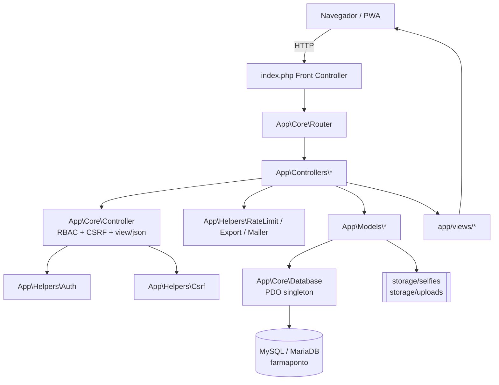

# FarmaPonto - Sistema de Gestao de Assiduidade


> Sistema de gestao de assiduidade para farmacias em Mocambique. Controle de ponto, faltas, atrasos e calculo automatico de cortes salariais.

---

## Funcionalidades

- **Marcacao de Presenca** - Entrada e saida com selfie (web, logado)
- **Marcacao Rapida (Kiosk)** - Terminal sem login com PIN de 4 digitos + selfie; deteta automaticamente entrada/saida
- **Dashboard Personalizado** - Admin/Gestor ve KPIs globais (presentes, atrasos, faltas, atividade geral); Funcionario ve apenas os seus proprios registos e estatisticas mensais
- **Validacao de Carga Horaria** - Impede saida antes de cumprir a carga diaria configurada (ex.: 8h desde a primeira entrada)
- **Historico com Filtros** - Consulta por periodo, funcionario e tipo; exportacao PDF e CSV; eliminacao em massa com cascade (selfies + registos + auditoria)
- **Funcionarios** - CRUD completo com codigo unico, cargo, salario, horario, carga diaria (DECIMAL), PIN de 4 digitos, dias de trabalho, toggle ativo/inativo
- **Calendario de Presencas** - Mapa mensal colorido com detalhe por dia; dupla cor verde+ambar para presenca com atraso
- **Gestao de Ferias** - Adicionar, editar e remover periodos de ferias por funcionario; validacao de limite anual e conflitos com marcacoes
- **Relatorios & Salarios** - Motor de calculo com filtros avancados (mes ou intervalo, dias do mes, dias da semana, funcionarios, o que descontar, modo de pagamento: mes completo, proporcional aos dias pagos ou proporcional ate ao dia X); descontos automaticos `corte_falta = faltas x salario_dia` e `corte_atraso = horas_atraso x salario_hora`; exportacao CSV e PDF personalizado (ExportDialog)
- **Minha Assiduidade (funcionario)** - Cada funcionario consulta em `/minha-assiduidade` o seu progresso mensal (percentagem de assiduidade, dias trabalhados, atrasos, faltas, saidas antecipadas), quanto foi cortado em cada falta/atraso e o liquido estimado; o calculo e o mesmo motor do relatorio do gestor, mas com o filtro forcado ao id da sessao (isolamento total entre colegas)
- **Modelos de Calculo** - Combinacoes de filtros guardadas na BD (`relatorio_modelos`) e reutilizaveis em qualquer mes (ex.: "Quinzena 1", "Somente dias uteis")
- **Recibo de Salario Individual** - Documento A4 imprimivel por funcionario (`/relatorios/recibo`) com identificacao, bases de calculo, assiduidade, detalhe dia-a-dia, apuramento e assinaturas; respeita os filtros activos e fica registado na auditoria
- **Recibos em Lote** - Um unico PDF A4 (`/relatorios/recibos`) com o recibo de todos os funcionarios filtrados, um por pagina, precedido de indice com totais
- **Folhas Salariais** - Fecho do calculo aprovado (`/folhas`) guardado como snapshot imutavel e auditavel; o relatorio continua a poder ser recalculado a qualquer momento com quaisquer filtros
- **Processamento de Faltas** - Insercao automatica de registos `falta` para dias de trabalho sem entrada num periodo
- **Logs do Sistema & Auditoria** - Auditoria completa com filtros avancados, estatisticas e exportacao PDF
- **Auto-registo Publico** - Opcional, ativado por config; cria contas como funcionario
- **Recuperacao de Password** - Por email com token de 60min; fallback para `storage/mail.log`
- **Perfil** - Gestao de dados pessoais, alteracao de PIN e password
- **Configuracoes** - Parametros personalizaveis (tolerancia, ferias, moeda, rate limits, logotipo, identidade)
- **PWA (Progressive Web App)** - Instalavel como app no Android/iOS/desktop; cache offline de paginas; indicador online/offline
- **Copias de Seguranca** - `/backup`: exportacao SQL nativa (sem mysqldump), ZIP completo com base de dados + fotografias, restauro pelo navegador, retencao das ultimas 14 copias e copia diaria automatica
- **Lixeira / Recuperacao** - `/lixeira`: registos, folhas e funcionarios eliminados ficam arquivados (dados em JSON) e podem ser recuperados; purga por retencao
- **Diagnostico e Saude** - `/diagnostico` (eventos, metricas de desempenho, estado do sistema) e `/saude` + `/api/v1/saude` (JSON para monitorizacao); cada pedido tem um identificador unico (`PEDIDO_ID`) presente nas mensagens de erro
- **Invariantes do Calculo** - Cada calculo salarial e verificado (liquido nunca negativo, corte nunca superior ao salario, soma das parcelas fecha com o total); qualquer desvio fica registado em `/diagnostico`
- **Manutencao Automatica** - Uma vez por dia (ou via `php cli/manutencao.php`): copia de seguranca, purga de fotografias antigas, resumo dos registos de actividade, limpeza da lixeira
- **Testes Automaticos** - `php tests/executar.php` (PHP puro, sem PHPUnit nem Composer) cobre as regras de assiduidade e todo o calculo salarial
- **Acessibilidade** - Link "Saltar para o conteudo", foco visivel, `aria-current` no menu, alvos de toque de 44px, alternativas em texto (ver `docs/acessibilidade.md`)
- **Portabilidade** - Ligacao configuravel por `config/config.local.php` ou variaveis `FP_*`; instalacao em XAMPP, Linux/Apache ou contentor (ver `docs/INSTALACAO.md`, `Dockerfile`, `docker-compose.yml`)

---

## Stack Tecnologica

| Camada | Tecnologia |
|--------|-----------|
| Backend | PHP 8.1+ puro (MVC artesanal, sem framework) |
| Banco de Dados | MySQL 8.0+ / MariaDB 10.6+ |
| Frontend | HTML5, Tailwind CSS (ficheiro local `assets/js/tailwind.js`), JavaScript ES2020 |
| PWA | Service Worker (vanilla JS) + Manifest |
| Paginacao | `assets/js/paginate.js` (vanilla JS) |
| Arquitetura | MVC + Front Controller |
| Tipos de letra / icones | Inter (`assets/vendor/inter.css` + `.woff2`) e Font Awesome 6.5 (`assets/vendor/fontawesome/`) — servidos pelo proprio servidor |
| Seguranca | CSRF, RBAC, bcrypt (cost 12), AES-256-CBC para credenciais reversiveis, sessoes seguras |

### 100% offline — sem dependencias externas

Nenhum ficheiro do sistema aponta para a Internet. CSS, JS, tipos de letra e icones
estao dentro de `assets/`. O Service Worker (`sw.js`) ignora por completo pedidos a
outras origens. Isto permite instalar o FarmaPonto numa farmacia sem ligacao a
Internet — basta PHP + MySQL na rede local.

```text
  Browser  ──HTTP──>  Apache/Nginx + PHP  ──PDO──>  MySQL/MariaDB
     │                        │
     │                        └── assets/ (tailwind.js, inter.css, fontawesome/)
     └── Service Worker: cache apenas de estaticos da MESMA origem
```

---

## Estrutura de Pastas

```
farmaponto/
├── index.php                 # Front Controller (Router)
├── install.php               # Instalacao do primeiro admin
├── farmaponto.sql            # Schema + seed + config (unico)
├── .htaccess                 # Regras Apache + seguranca
├── manifest.webmanifest      # PWA manifest
├── sw.js                     # Service Worker
├── robots.txt                # SEO
├── sitemap.xml               # SEO
├── offline.html              # Pagina offline PWA
├── Dockerfile                # Imagem minima PHP+Apache (opcional)
├── docker-compose.yml        # Aplicacao + base de dados num comando (opcional)
├── cli/
│   ├── bootstrap.php         # Arranque para linha de comandos
│   ├── backup.php            # Copia de seguranca agendavel
│   └── manutencao.php        # Manutencao diaria agendavel
├── tests/
│   ├── executar.php          # Executor de testes (php tests/executar.php)
│   ├── CalculoSalarialTest.php
│   └── RegrasAssiduidadeTest.php
├── docs/
│   ├── INSTALACAO.md         # Instalar e mudar de servidor
│   ├── testes.md             # Testes automaticos e verificacao manual
│   └── acessibilidade.md     # Regras e verificacao de acessibilidade
├── config/
│   ├── config.php            # Configuracoes do sistema (le FP_* e config.local.php)
│   └── .htaccess             # Protecao (Deny from all)
├── app/
│   ├── core/
│   │   ├── Database.php      # Singleton PDO
│   │   ├── Router.php        # Dispatcher de rotas
│   │   └── Controller.php    # Controller base (MVC)
│   ├── services/                 # Regras puras, testaveis, sem BD
│   │   ├── CalculoSalarial.php   # Valor/dia, valor/hora, cortes, tecto de corte, liquido
│   │   └── RegrasAssiduidade.php # Tolerancia, atraso, saida antecipada, escala, HH:MM:SS
│   ├── helpers/
│   │   ├── Auth.php          # Autenticacao e sessao (login, RBAC, validacao PIN)
│   │   ├── Backup.php        # Exportacao/restauro SQL e ZIP completo (nativo)
│   │   ├── Saude.php         # Estado do sistema para /saude
│   │   ├── Manutencao.php    # Tarefas diarias (copia, purgas, resumos)
│   │   ├── Invariantes.php   # Rede de seguranca do calculo salarial
│   │   ├── Csrf.php          # Tokens CSRF
│   │   ├── Mailer.php        # Envio de email (PHPMailer + fallback mail.log)
│   │   ├── RateLimit.php     # Limitador de taxa (login, registo, quickpunch)
│   │   └── Export.php        # Exportacao CSV
│   ├── models/
│   │   ├── Funcionario.php   # CRUD funcionarios, autenticacao, porPin(), getDiasTrabalho()
│   │   ├── Registo.php       # Marcacoes, agregacoes mensais, validacao transicoes, ferias
│   │   ├── Selfie.php        # Persistencia de imagens (disco e BD)
│   │   ├── Log.php           # Auditoria de acoes
│   │   ├── Config.php        # Configuracoes dinamicas (chave/valor)
│   │   ├── PasswordReset.php # Tokens de recuperacao de password
│   │   ├── RelatorioModelo.php # Modelos de calculo (presets de filtros)
│   │   └── DiaAjuste.php       # Ajustes por dia (justificacoes, folgas, horas extra)
│   ├── controllers/
│   │   ├── AuthController.php          # Login, logout, registo, forgot/reset password
│   │   ├── DashboardController.php     # Dashboard admin (geral) e funcionario (individual)
│   │   ├── MarcarController.php        # Marcacao web com selfie
│   │   ├── QuickPunchController.php    # Marcacao rapida kiosk (sem login, PIN + selfie)
│   │   ├── HistoricoController.php     # Listagem, filtros e eliminacao em massa
│   │   ├── FuncionariosController.php  # CRUD funcionarios, ferias, stats, calendario
│   │   ├── RelatoriosController.php    # Relatorio mensal, CSV, PDF, recibos, folhas, /minha-assiduidade
│   │   ├── LogsController.php          # Logs e exportacao PDF
│   │   ├── AuditoriaController.php     # Vista de auditoria com filtros e estatisticas
│   │   ├── ConfigController.php        # Configuracoes do sistema + upload logo
│   │   └── PerfilController.php        # Perfil, estatisticas, PIN/password
│   └── views/
│       ├── layout/
│       │   ├── header.php    # Layout com sidebar responsiva + navegacao RBAC
│       │   └── footer.php    # Scripts e fechamento
│       ├── public/
│       │   ├── login.php     # Pagina de login com link "Esqueci-me" e auto-registo
│       │   ├── register.php  # Auto-registo publico (opcional)
│       │   ├── forgot.php    # Pedido de reset de password
│       │   ├── reset.php     # Definir nova password com token
│       │   ├── quickpunch.php # Terminal marcacao rapida (PIN + selfie)
│       │   └── erro.php      # Pagina de erro 404
│       └── admin/
│           ├── dashboard.php            # Dashboard admin/gestor (KPIs globais)
│           ├── dashboard_funcionario.php # Dashboard funcionario (dados proprios)
│           ├── minha_assiduidade.php # Progresso e cortes do proprio funcionario
│           ├── marcar.php               # Marcacao com camera (entrada/saida)
│           ├── funcionario_detalhe.php   # Detalhe do funcionario com calendario
│           ├── funcionarios.php         # CRUD funcionarios + ferias
│           ├── historico.php            # Tabela com filtros + delete bulk
│           ├── relatorios.php           # Tabela relatorio + ExportDialog PDF
│           ├── relatorio_pdf.php        # Template PDF imprimivel A4
│           ├── logs.php                 # Tabela auditoria + botao exportar PDF
│           ├── logs_pdf.php             # Template PDF logs imprimivel
│           ├── auditoria.php            # Auditoria com filtros e estatisticas
│           ├── config.php               # Parametros do sistema + logo
│           └── perfil.php               # Dados pessoais, estatisticas, PIN/password
├── assets/
│   ├── js/
│   │   └── paginate.js       # Helper de paginacao + filtro
│   └── images/
├── storage/
│   ├── selfies/              # Fotos capturadas (protegido)
│   ├── uploads/              # Logo institucional
│   └── .htaccess             # Deny from all
```

---

## Instalacao

### Requisitos

- PHP 8.1 ou superior com extensoes: `pdo_mysql`, `mbstring`, `openssl`, `fileinfo`, `gd`
- MySQL 8.0+ ou MariaDB 10.6+
- Apache 2.4 com `mod_rewrite` ativado
- Pasta `storage/` com permissao de escrita

### Passos

1. Copiar a pasta `farmaponto/` para o servidor (htdocs / public_html)
2. Importar `database.sql` no phpMyAdmin ou por linha de comando
   (`mysql -u root -p < database.sql`). Este ficheiro unico cria a BD `farmaponto`,
   todas as tabelas, indices, chaves estrangeiras, as configuracoes iniciais e os
   modelos de calculo pre-definidos
3. Copiar `config/config.example.php` para `config/config.php` e editar as credenciais da BD
4. Aceder a `http://localhost/farmaponto/install.php` para criar o primeiro administrador
5. Aceder a `http://localhost/farmaponto/login`

O `database.sql` e **idempotente**: as tabelas usam `CREATE TABLE IF NOT EXISTS` e as
seeds usam `INSERT ... ON DUPLICATE KEY UPDATE`, pelo que pode ser reimportado sobre uma
base ja existente sem perder dados nem duplicar registos. Nao existem ficheiros SQL
alternativos nem migracoes soltas: a base de dados do sistema e um unico ficheiro.


| Tabela | Funcao | Eliminacao em cascata |
|--------|--------|-----------------------|
| `funcionarios` | Pessoas (admin, gestor, funcionario) | raiz |
| `funcionario_dias_trabalho` | Escala especifica por mes (`YYYY-MM`) | CASCADE |
| `selfies` | Fotos de marcacao (metadados; ficheiro em `storage/`) | CASCADE |
| `registos` | Entradas, saidas, faltas e ferias | CASCADE (selfie: SET NULL) |
| `logs` | Auditoria de accoes | SET NULL (preserva historico) |
| `password_resets` | Tokens de recuperacao | CASCADE |
| `config` | Parametros chave/valor do sistema | — |
| `relatorio_modelos` | Presets de filtros de calculo | autor: SET NULL |

---

## Perfis de Utilizador (RBAC)

| Perfil | Permissoes |
|--------|-----------|
| **Admin** | Acesso total: funcionarios, ferias, relatorios, logs, auditoria, configuracoes |
| **Gestor** | Dashboard, relatorios, historico de todos, marcar presenca |
| **Funcionario** | Marcar presenca, ver proprio historico, perfil |

---

## Fluxo de Marcacao

### Web (logado) — `/marcar`

```
[Funcionario autenticado abre /marcar]
    |
    v
[Inicia camera] getUserMedia()
    |
    v
[Captura selfie] canvas -> JPEG base64
    |
    v
[Clica ENTRADA ou SAIDA]
    |
    v
[POST /marcar/registar] {tipo, selfie_b64, observacao, csrf}
    |
    v
[Servidor] valida CSRF -> valida transicao (entrada->saida->entrada)
    -> grava selfie -> insere registo -> log
```

- Nao pede PIN — o utilizador ja esta autenticado por sessao
- A selfie e obrigatoria para entrada e saida

### Kiosk (sem login) — `/quickpunch`

```
[Funcionario digita PIN de 4 digitos na tela /quickpunch]
    |
    v
[POST /quickpunch/verificar-pin] ---valida via bcrypt---> OK
    |
    v
[Deteta tipo automaticamente] proximoTipo() = entrada ou saida
    |
    v
[Camera + selfie] captura e envia
    |
    v
[POST /quickpunch/punch] {codigo, pin, tipo, selfie_b64, csrf}
    |
    v
[Servidor] valida PIN -> valida transicao -> valida carga horaria (saida)
    -> grava selfie -> insere registo -> log
```

- PIN obrigatorio: exactamente 4 digitos numericos (`/^\d{4}$/`)
- O tipo (entrada/saida) e detetado automaticamente pelo ultimo registo do dia

### Validacao de Carga Horaria (saida)

- A saida **so e permitida** quando o tempo decorrido desde a primeira entrada do dia for >= `carga_diaria` horas
- Exemplo: funcionario com `carga_diaria = 8.5` entrou as 08:00 -> pode sair a partir das 16:30
- A validacao e feita tanto no `MarcarController` (web) como no `QuickPunchController` (kiosk)

### Nao ha intervalos

O sistema regista apenas **Entrada** e **Saida**. Intervalos (pausas, almoco) nao sao controlados — a carga horaria ja contabiliza o tempo total esperado no dia.

---

## Regras de Negocio

| Regra | Valor | Onde se aplica |
|-------|-------|----------------|
| Hora de entrada | 08:00 (configuravel) | Calculo de atrasos e tolerancia |
| Tolerancia de atraso | 5 minutos (configuravel) | Atraso contado apos +5min da hora de entrada |
| Corte por falta | `faltas x salario_dia` | `salario_dia = salario_base / 30` |
| Corte por atraso | `horas_atraso x salario_hora` | `salario_hora = salario_dia / carga_diaria` |
| Carga diaria | 8.00 horas (DECIMAL) | Tempo minimo entre entrada e saida |
| Validacao entrada+carga | ±15 min | `hora_entrada + carga_diaria ≈ hora_saida` |
| Moeda | MZN (configuravel) | Metical Mocambicano |
| Formato hora | HH:MM (24h) | `type="text"` com `pattern="\d{2}:\d{2}"`, JS auto-formata |
| Formato data | d/m/Y | Em todo o sistema |
| Fuso horario | Africa/Maputo | PHP e MySQL |

### Fluxo de Transicoes Permitidas

| Tipo | Permissao |
|------|-----------|
| **entrada** | Sempre que o ultimo registo do dia for `null` ou `saida` |
| **saida** | Apenas apos `entrada` |

### Gestao de Ferias

- Admin pode adicionar, editar e remover periodos de ferias
- Por defeito ignora sabado e domingo (checkbox para incluir)
- Anti-duplicado: dias ja marcados como ferias sao saltados
- Dias de ferias **nao contam como falta** e **nao geram corte salarial**
- Limite anual configuravel (`ferias_max_dias_ano`, default 22)
- Validacao de conflitos: se houver marcacoes no intervalo, admin e avisado e pode forcar
- Toda a operacao e auditada em logs

---

## Endpoints / Rotas

| Metodo | Rota | Controller | Permissao |
|--------|------|-----------|-----------|
| GET | `/login` | Auth@loginForm | Publico |
| POST | `/login` | Auth@login | Publico |
| GET | `/logout` | Auth@logout | Logado |
| GET | `/register` | Auth@registerForm | Publico (config) |
| POST | `/register` | Auth@register | Publico (config) |
| GET | `/forgot-password` | Auth@forgotForm | Publico |
| POST | `/forgot-password` | Auth@forgot | Publico |
| GET | `/reset-password` | Auth@resetForm | Publico (token) |
| POST | `/reset-password` | Auth@reset | Publico (token) |
| GET | `/quickpunch` | QuickPunch@index | Publico |
| POST | `/quickpunch/verificar-pin` | QuickPunch@verificarPin | Publico |
| POST | `/quickpunch/punch` | QuickPunch@punch | Publico |
| GET | `/dashboard` | Dashboard@index | Logado |
| GET | `/marcar` | Marcar@index | Logado |
| POST | `/marcar/registar` | Marcar@registar | Logado |
| GET | `/historico` | Historico@index | Logado |
| GET | `/minha-assiduidade` | Relatorios@minhaAssiduidade | Logado (marca ponto) |
| POST | `/historico/eliminar` | Historico@eliminar | Admin/Gestor |
| GET | `/auditoria` | Auditoria@index | Admin/Gestor |
| GET | `/auditoria/detalhe/{id}` | Auditoria@detalhe | Admin/Gestor |
| GET | `/perfil` | Perfil@index | Logado |
| POST | `/perfil/atualizar` | Perfil@atualizar | Logado |
| POST | `/perfil/pin` | Perfil@alterarPin | Logado |
| POST | `/perfil/password` | Perfil@alterarPassword | Logado |
| GET | `/funcionarios` | Funcionarios@lista | Admin/Gestor |
| GET | `/funcionarios/dados/{id}` | Funcionarios@dados | Admin/Gestor |
| POST | `/funcionarios/criar` | Funcionarios@criar | Admin |
| POST | `/funcionarios/atualizar/{id}` | Funcionarios@atualizar | Admin |
| POST | `/funcionarios/toggle/{id}` | Funcionarios@toggleAtivo | Admin |
| POST | `/funcionarios/pin/{id}` | Funcionarios@resetarPin | Admin |
| GET | `/funcionarios/credenciais/{id}` | Funcionarios@credenciais | Admin/Gestor |
| GET | `/funcionarios/stats/{id}` | Funcionarios@statsJson | Admin/Gestor |
| POST | `/funcionarios/ferias/{id}` | Funcionarios@adicionarFerias | Admin |
| POST | `/funcionarios/ferias/remover/{id}` | Funcionarios@removerFerias | Admin |
| GET | `/funcionarios/ferias/listar/{id}` | Funcionarios@listarFerias | Admin/Gestor |
| GET | `/funcionarios/ajustes/{id}` | Funcionarios@listarAjustes | Admin/Gestor |
| POST | `/funcionarios/ajustes/{id}` | Funcionarios@guardarAjuste | Admin/Gestor |
| POST | `/funcionarios/ajustes/remover/{id}` | Funcionarios@removerAjuste | Admin/Gestor |
| POST | `/funcionarios/ferias/editar/{id}` | Funcionarios@editarFerias | Admin |
| GET | `/relatorios` | Relatorios@mensal | Admin/Gestor |
| GET | `/relatorios/csv` | Relatorios@exportarCsv | Admin/Gestor |
| GET | `/relatorios/pdf` | Relatorios@exportarPdf | Admin/Gestor |
| GET | `/relatorios/recibo` | Relatorios@recibo | Admin/Gestor |
| GET | `/relatorios/recibos` | Relatorios@recibosLote | Admin/Gestor |
| GET | `/relatorios/detalhe` | Relatorios@detalhe | Admin/Gestor |
| POST | `/relatorios/processar-faltas` | Relatorios@processarFaltas | Admin/Gestor |
| GET | `/relatorios/modelos` | Relatorios@modelos | Admin/Gestor |
| POST | `/relatorios/modelos/guardar` | Relatorios@guardarModelo | Admin/Gestor |
| POST | `/relatorios/modelos/eliminar` | Relatorios@eliminarModelo | Admin/Gestor |
| GET | `/folhas` | Relatorios@folhas | Admin/Gestor |
| GET | `/folhas/{id}` | Relatorios@verFolha | Admin/Gestor |
| POST | `/folhas/fechar` | Relatorios@fecharFolha | Admin/Gestor |
| POST | `/folhas/reabrir` | Relatorios@reabrirFolha | Admin/Gestor |
| POST | `/folhas/eliminar` | Relatorios@eliminarFolha | Admin |
| GET | `/logs` | Logs@index | Admin |
| GET | `/logs/pdf` | Logs@exportarPdf | Admin |
| GET | `/configuracoes` | Config@index | Admin |
| POST | `/configuracoes/salvar` | Config@salvar | Admin |
| POST | `/configuracoes/limpar-selfies` | Config@limparSelfies | Admin |
| POST | `/configuracoes/logo` | Config@uploadLogo | Admin |
| POST | `/configuracoes/logo/remover` | Config@removerLogo | Admin |
| GET | `/selfie/{id}` | Selfie@ver | Logado |

---

## Arquitetura do Sistema

```
                    NAVEGADOR (PWA)
   +-----------------------------------------------+
   | HTML + Tailwind CDN | paginate.js | sw.js      |
   +-----------------------+-----------------------+
                           | HTTP (GET/POST, fetch JSON)
                           v
                    index.php  (Front Controller)
                           |
                  +--------+--------+
                  |   App\Core\Router |
                  +--------+--------+
                           v
              App\Controllers\*Controller
              (RBAC + CSRF via App\Core\Controller)
                    |               |
       +------------+               +-------------+
       v                                          v
 App\Helpers\*                             App\Models\*
 Auth | Csrf | RateLimit | Export | Mailer   Funcionario | Registo
                                             Selfie | Log | Config
                                             PasswordReset
                                             RelatorioModelo
                                |
                                v
                     App\Core\Database (PDO singleton)
                                |
                                v
                     MySQL / MariaDB  `farmaponto`
                                |
                     storage/selfies  storage/uploads
```

Camadas e responsabilidades:

| Camada | Responsabilidade | Nunca faz |
|--------|------------------|-----------|
| View (`app/views`) | Apresentacao, escape HTML, JS de UI | Query a BD |
| Controller | Validar entrada, RBAC, CSRF, orquestrar models, responder view/JSON | SQL directo |
| Model | SQL com prepared statements, agregacoes, transacoes | Echo/HTML |
| Core | Router, Database (PDO), Controller base | Regra de negocio |
| Helpers | Sessao, CSRF, rate limit, export, email | Persistencia de dominio |

---

## Modelo de Dados

```
                     +---------------------------+
                     |       funcionarios        |
                     |---------------------------|
                     | PK id                     |
                     | UK codigo                 |
                     | UK email                  |
                     | nome, cargo, perfil       |
                     | password_hash, pin_hash   |
                     | password_cifrada          |
                     | pin_cifrado (AES-256-CBC) |
                     | salario_base, salario_dia |
                     | salario_hora, salario_min |
                     | carga_diaria, dias_trabalho|
                     | hora_entrada, hora_saida  |
                     | ativo, criado_em          |
                     +------+-----+------+-------+
                            |     |      |
      +---------------------+     |      +---------------------------+
      |                           |                                  |
      v                           v                                  v
+-----------------+   +---------------------------+     +---------------------------+
|    registos     |   | funcionario_dias_trabalho |     |      password_resets      |
|-----------------|   |---------------------------|     |---------------------------|
| PK id           |   | PK id                     |     | PK id                     |
| FK funcionario_id|  | FK funcionario_id         |     | FK funcionario_id         |
| tipo (enum)     |   | ano_mes (YYYY-MM)         |     | token (64 hex), expira_em |
| marcado_em      |   | dias (CSV de dias do mes) |     +---------------------------+
| FK selfie_id    |   +---------------------------+
| ip, user_agent  |
| observacao      |          +-------------------+        +--------------------+
+--------+--------+          |      selfies      |        |        logs        |
         |                   |-------------------|        |--------------------|
         +------------------>| PK id             |        | PK id              |
                             | FK funcionario_id |        | FK funcionario_id  |
                             | caminho, bytes    |        | acao, entidade     |
                             | hash_sha256       |        | entidade_id        |
                             +-------------------+        | detalhes (JSON)    |
                                                          | ip, criado_em      |
+---------------------+   +-------------------+           +--------------------+
| relatorio_modelos   |   |   rate_limits     |
|---------------------|   |-------------------|           +--------------------+
| PK id               |   | PK id             |           |       config       |
| UK nome             |   | chave, ip         |           |--------------------|
| filtros (JSON)      |   | criado_em         |           | PK chave           |
| FK criado_por       |   +-------------------+           | valor, atualizado  |
| criado_em/atualizado|                                    +--------------------+
+---------------------+
```

| Tabela | Finalidade | Relacoes | Politica de eliminacao |
|--------|-----------|----------|------------------------|
| `funcionarios` | Pessoas, credenciais, parametros salariais e horario | raiz | — |
| `registos` | Marcacoes: `entrada`, `saida`, `ferias`, `falta`, `atraso`, `atestado` | FK funcionario, FK selfie | `ON DELETE CASCADE` (func), `SET NULL` (selfie) |
| `selfies` | Metadados da foto (ficheiro em `storage/selfies`) | FK funcionario | `CASCADE` |
| `funcionario_dias_trabalho` | Dias de trabalho especificos por mes (`ano_mes` + CSV de dias) | FK funcionario | `CASCADE` |
| `logs` | Auditoria de todas as accoes com payload JSON | FK funcionario | `SET NULL` |
| `config` | Parametros do sistema (chave/valor) | — | — |
| `password_resets` | Tokens de recuperacao (60 min, uso unico) | FK funcionario | `CASCADE` |
| `rate_limits` | Contagem de tentativas por chave + IP | — | limpeza por janela temporal |
| `relatorio_modelos` | Modelos de calculo (presets de filtros em JSON) | FK criado_por | `SET NULL` |
| `dia_ajustes` | Excepcoes por dia: falta justificada, folga, licenca, ferias, com/sem vencimento e horas extra | FK funcionario | `CASCADE`, UK (funcionario_id, dia) |

Notas de estrutura de dados:

- Ferias, faltas e atestados vivem na mesma tabela `registos` via `tipo` — uma unica linha do tempo por funcionario, sem tabelas paralelas.
- `funcionario_dias_trabalho` tem precedencia sobre `funcionarios.dias_trabalho`; quando nao existe registo para o `ano_mes`, o sistema usa o CSV de dias da semana do funcionario.
- `dia_ajustes` tem precedencia sobre o estado apurado a partir de `registos`: e a fonte de verdade para justificacoes e horas extra de um dia.
- `funcionarios.valor_hora_extra` define o valor pago por hora extra; quando e 0 o motor usa o `valor_hora` normal.
- `relatorio_modelos.filtros` guarda apenas chaves de uma whitelist (`RelatorioModelo::CHAVES`), nunca a query string crua.

---

## Motor de Calculo de Salarios

Todo o calculo vive em `RelatoriosController::calcular()` e e recalculado a cada request (sem cache).

```
[GET /relatorios com filtros]
        |
        v
[1] Resolver periodo        modo=mes  -> 1..ultimo dia do mes
                            modo=intervalo -> de .. ate (datas futuras ignoradas)
        |
        v
[2] Construir lista de dias  aplica filtro dias_mes[] e dias_semana[]
        |
        v
[3] Para cada funcionario (filtro func_id[], exclui admin)
        |
        +--> ferias no dia?          -> conta ferias, sem falta e sem corte
        +--> dia nao e de trabalho?  -> ignorado
        +--> sem entrada?            -> falta (dia corrente ainda em curso e ignorado)
        +--> com entrada?            -> atraso  = entrada - hora_entrada (apos tolerancia)
                                        cedo    = hora_saida - saida
                                        horas   = saida - entrada
        |
        v
[4] Ajustes de dia (tabela dia_ajustes) sobrepoem-se ao apurado:
              falta_justificada -> conta como dia pago, sem corte
              folga / licenca   -> com ou sem vencimento (escolha do gestor)
              ferias            -> dia pago
              horas_extra       -> somadas ao ganho extra do periodo
        |
        v
[5] Cortes    corte_falta  = faltas x valor_dia         (se contar_faltas)
              corte_atraso = horas_penalizadas x valor_hora
              horas_penalizadas = atraso (se contar_atrasos) + cedo (se contar_saida_cedo)
              corte_sem_vencimento = dias marcados sem vencimento x valor_dia
                                     (apenas na base mes_completo)
        |
        v
[6] Base      mes_completo -> salario_base cheio
              proporcional -> dias_pagos x valor_dia
              ate_dia      -> dias pagos ate ao dia X x valor_dia
        |
        v
[7] Piso      cortes nunca ultrapassam o saldo acima dos dias efectivamente
              trabalhados/justificados (flag corte_limitado sinaliza o ajuste)
        |
        v
[8] liquido = max(0, base - cortes) + ganho_extra
              ganho_extra = horas_extra x valor_hora_extra (se contar_extras)
```

Valores derivados:

| Valor | Formula | Fallback |
|-------|---------|----------|
| `valor_dia` | `salario_base / dias de trabalho programados do mes` (escala do funcionario) | `salario_base / 30` se a escala estiver vazia |
| `valor_hora` | `funcionarios.salario_hora` | `valor_dia / carga_diaria` |
| `horas_deveria` | `dias_esperados x carga_diaria` | — |
| `valor_hora_extra` | `funcionarios.valor_hora_extra` | `valor_hora` |

### Filtros disponiveis (GET em `/relatorios`, `/relatorios/csv`, `/relatorios/pdf`)

| Parametro | Valores | Efeito |
|-----------|---------|--------|
| `modo` | `mes` \| `intervalo` | Escolhe o tipo de periodo |
| `mes` | `YYYY-MM` | Periodo quando `modo=mes` |
| `de`, `ate` | `YYYY-MM-DD` | Periodo quando `modo=intervalo` (invertidos sao corrigidos) |
| `func_id[]` | ids | Calcula apenas estes funcionarios (vazio = todos) |
| `dias_mes[]` | `1..31` | So estes dias do mes entram no calculo (ex.: 4 a 10) |
| `dias_semana[]` | `1..7` (1=Seg) | So estes dias da semana entram no calculo |
| `contar_faltas` | `0` \| `1` | Liga/desliga o corte por falta |
| `contar_atrasos` | `0` \| `1` | Liga/desliga o corte por atraso |
| `contar_saida_cedo` | `0` \| `1` | Liga/desliga o corte por saida antecipada |
| `base` | `mes_completo` \| `proporcional` \| `ate_dia` | Modo de pagamento (o valor legado `integral` e convertido em `mes_completo`) |
| `dia_corte` | `1..31` | Dia limite quando `base=ate_dia` |
| `pagar_futuros` | `0` \| `1` | Inclui dias programados ainda por decorrer (forcado a `1` em `mes_completo`) |
| `contar_extras` | `0` \| `1` | Soma as horas extra lancadas em `dia_ajustes` |

Exemplo — salario do funcionario 17, apenas dias 4 a 10, so descontando faltas:

```
/relatorios?modo=mes&mes=2026-08&func_id[]=17
           &dias_mes[]=4&dias_mes[]=5&dias_mes[]=6&dias_mes[]=7
           &dias_mes[]=8&dias_mes[]=9&dias_mes[]=10
           &contar_faltas=1&contar_atrasos=0&contar_saida_cedo=0&base=proporcional
```

### Exportacao sincronizada (CSV e PDF)

Ambas as exportacoes **recalculam** o relatorio com exactamente os mesmos filtros da
query string, por isso o documento nunca diverge do que esta no ecra.

Fonte unica de colunas: `RelatoriosController::colunasExportaveis()` (chave -> rotulo),
com `colunasMonetarias()` e `colunasNumericas()` a definir formatacao e alinhamento.
A vista `relatorios.php` (ExportDialog), a vista `relatorio_pdf.php` e o CSV consomem
esse mesmo catalogo — acrescentar uma coluna e alterar apenas o metodo do controlador.

| Coluna | Significado |
|--------|-------------|
| `salario` / `salario_base` | Salario do periodo conforme o modo de pagamento / salario contratual |
| `dias_programados` / `dias_trabalhados` / `dias_pagos` | Escala prevista / dias com presenca / dias com vencimento |
| `faltas` / `faltas_justificadas` / `atrasos` / `saidas_cedo` / `ferias` | Contadores de assiduidade |
| `horas` / `horas_atraso` / `horas_deveria` | Totais em `HH:MM:SS` |
| `horas_extra` / `ganho_extra` | Horas extra lancadas em `dia_ajustes` e o respectivo valor |
| `corte_atraso` / `corte_falta` / `corte_sem_vencimento` / `total_corte` | Cortes ja limitados pelo piso |
| `liquido` | `max(0, salario - total_corte) + ganho_extra` |

```
GET /relatorios/csv?<mesmos filtros>   -> CSV com cabecalho de auditoria + totais
GET /relatorios/pdf?<filtros>&colunas=nome,salario,... -> HTML A4 (window.print)
```

- **CSV**: cabecalho com periodo, modo de pagamento, cortes activos, tolerancia e
  filtros de dias; depois a tabela; no fim `Total cortes` e `Total liquido`.
  Nome do ficheiro: `relatorio_salarios_YYYY-MM` ou `relatorio_salarios_de_a_ate`.
- **PDF**: subtitulo com o periodo e o modo de pagamento, totais (incluindo horas
  extra quando existem), linha com os filtros aplicados e nota metodologica que
  explica o `valor_dia` dinamico e o piso dos cortes.


### Modelos de calculo

Combinacoes de filtros guardadas em `relatorio_modelos` e aplicaveis com um clique:

```
[Ecra Relatorios] --Guardar filtros atuais--> POST /relatorios/modelos/guardar
                                              (nome + filtros normalizados -> JSON)
[Selecionar modelo] --------------------------> GET /relatorios?<query do modelo>
[Eliminar] ----------------------------------> POST /relatorios/modelos/eliminar
```

- Nome unico: guardar com um nome existente actualiza o modelo (upsert).
- Modelos pre-definidos no `farmaponto.sql`: Mes completo, Quinzena 1, Quinzena 2, Somente dias uteis, Sem cortes de atraso.
- Cada operacao e auditada (`modelo_calculo_guardado`, `modelo_calculo_eliminado`).

### Detalhe dia-a-dia por funcionario

Cada linha do relatorio abre um painel com a justificacao completa do valor calculado.
O detalhe usa exactamente os mesmos filtros activos no ecra (periodo, dias do mes,
dias da semana, opcoes de desconto), pelo que os totais batem sempre certo.

```
[Relatorios]  linha do funcionario
     |  clique no chevron
     v
GET /relatorios/detalhe?func_id=X&<filtros actuais>
     |
     v
{ periodo, moeda, resumo, detalhe:[ dia, dia_semana, estado, entrada, saida,
                                    horas, horas_atraso, horas_cedo,
                                    atrasado, saiu_cedo, corte, observacao ] }
```

Estados possiveis de um dia:

| Estado | Significado | Entra em "dias pagos" | Pode gerar corte |
|--------|-------------|----------------------|------------------|
| `presente` | Ha entrada registada | Sim | Sim (atraso / saida antecipada) |
| `falta` | Dia de escala sem entrada | Sim | Sim (valor dia inteiro) |
| `ferias` | Coberto por periodo de ferias | Nao (contado a parte) | Nao |
| `nao_trabalha` | Fora da escala semanal / mensal | Nao | Nao |
| `em_curso` | Hoje, antes da hora de saida | Nao | Nao |
| `falta_justificada` | Falta aceite pelo gestor | Sim | Nao |
| `folga` / `licenca` | Ajuste manual do gestor | Depende de `com_vencimento` | Sim, se sem vencimento |
| `futuro` | Dia de escala ainda por decorrer | Depende de `pagar_futuros` | Nao |

Regras de consistencia garantidas:

- A soma da coluna `corte` do detalhe e igual ao `total_corte` do resumo (as horas
  de atraso e saida antecipada sao usadas sem arredondamento intermedio; o
  arredondamento existe apenas na apresentacao `HH:MM:SS`).
- Desligar "Faltas", "Atrasos" ou "Saida antecipada" zera o corte correspondente
  tanto no resumo como no detalhe.
- O detalhe e calculado a pedido (nao e guardado em sessao), evitando sessoes
  pesadas quando ha muitos funcionarios.

```
Corte do dia
 |-- estado = falta      e contar_faltas       -> + valor_dia
 |-- estado = presente   e contar_atrasos      -> + horas_atraso x valor_hora
 |-- estado = presente   e contar_saida_cedo   -> + horas_cedo  x valor_hora
 '-- restantes estados                          -> 0
```

---

### Minha Assiduidade (visao do proprio funcionario)

O funcionario tem acesso de leitura ao seu proprio apuramento, sem qualquer
permissao sobre dados de colegas. A pagina reutiliza o motor `calcular()` do
`RelatoriosController` — nao existe segunda formula no sistema, logo o valor que
o funcionario ve e exactamente o que o gestor ve.

```
[Funcionario]  menu "Minha Assiduidade"  (ou botao no dashboard pessoal)
     |
     v
GET /minha-assiduidade?mes=YYYY-MM
     |
     |-- requireLogin()                       sessao valida
     |-- Auth::marcaPonto()                   contas administrativas -> 403
     |-- $_GET := { modo:mes, mes, func_id:[Auth::id()], base:mes_completo }
     |          (o servidor descarta qualquer outro parametro do endereco)
     v
calcular()  ->  resumo + detalhe dia-a-dia do proprio funcionario
     v
view admin/minha_assiduidade
     |-- barra de progresso  = dias_trabalhados / dias_avaliados x 100
     |-- cartoes             = dias trabalhados, atrasos, faltas, saidas cedo
     |-- cortes do mes       = corte_falta, corte_atraso, corte_sem_vencimento,
     |                         ganho_extra, total_corte
     |-- estimativa          = salario do periodo, cortes, liquido, horas
     '-- tabela dia a dia    = estado, entrada, saida, horas, atraso,
                               saida antecipada, CORTE do dia, observacao
```

Garantias de isolamento e consistencia:

- `func_id` do endereco e ignorado: o filtro e sempre `[Auth::id()]`. Alterar o
  endereco nao expoe outro funcionario.
- Contas com `marca_ponto = 0` (administrativas) recebem 403 e nao veem o item
  de menu, porque nao entram na assiduidade.
- `$_SESSION['ultimo_relatorio']` e restaurado apos o calculo, para nao
  interferir com as exportacoes do gestor na mesma sessao.
- Dias `nao_trabalha` sao omitidos da tabela; a soma da coluna "Corte" iguala o
  `total_corte` apresentado, pela mesma regra de tecto de cortes do relatorio.
- Os valores sao indicativos enquanto o mes nao e fechado; o documento oficial
  continua a ser a folha salarial fechada em `/folhas`.

---

### Recibo de salario individual

Cada linha do relatorio tem um botao de recibo que abre um documento A4 imprimivel
(`Ctrl+P` -> guardar como PDF) so para aquele funcionario, ja com os filtros activos
no ecra aplicados. E o comprovativo entregue ao trabalhador.

```
GET /relatorios/recibo?func_id=X&<mesmos filtros do relatorio>
        |
        v
 +-------------------------------------------------------+
 | Cabecalho: logo + instituicao + referencia + data      |
 | Identificacao: nome, cargo, email, horario, carga      |
 | Bases: salario base, valor dia, valor hora, tolerancia |
 | Assiduidade: dias pagos, faltas, atrasos, ferias, horas|
 | Detalhe dia-a-dia (data, estado, entrada/saida, corte) |
 | Apuramento: salario - cortes = liquido                 |
 | Assinaturas: funcionario / entidade                    |
 | Rodape: formulas + tolerancia + nota configuravel      |
 +-------------------------------------------------------+
```

Parametros opcionais (alem dos filtros do relatorio):

| Parametro | Efeito | Omissao |
|-----------|--------|---------|
| `titulo_doc` | Titulo do documento | `Recibo de Salario` |
| `instituicao` | Nome no cabecalho | `config.instituicao` |
| `autor` | Nome na assinatura da entidade | utilizador autenticado |
| `nota_rodape` | Texto extra no rodape | `config.relatorio_nota_rodape` |
| `mostrar_detalhe` | `0` imprime so o apuramento | `1` (com detalhe diario) |

Garantias:

- O recibo reutiliza o mesmo motor de calculo do relatorio e do detalhe diario,
  por isso os valores sao sempre identicos aos do ecra e do PDF geral.
- A soma da coluna `Corte` do detalhe e igual ao `Total de cortes` do apuramento.
- A emissao fica registada na auditoria com a accao `recibo_emitido`
  (funcionario, periodo e liquido apurado).
- O layout segue o mesmo padrao visual do `relatorio_pdf` (A4, serifa, verde
  institucional, logo da instituicao quando configurado).

### Recibos em lote (um PDF com todos os funcionarios)

Alem do recibo individual, o ecra `/relatorios` permite gerar **um unico documento**
com o recibo de cada funcionario incluido nos filtros activos (um recibo por pagina A4),
precedido de um indice com os totais.

```
GET /relatorios/recibos?<mesmos filtros do relatorio>
        |
        v
 +-------------------------------------------------------+
 | Pagina 0 : INDICE                                      |
 |   n recibos | total de cortes | total liquido          |
 |   tabela: # | funcionario | cargo | cortes | liquido   |
 +-------------------------------------------------------+
 | Pagina 1 : recibo do funcionario A   (page-break)      |
 | Pagina 2 : recibo do funcionario B   (page-break)      |
 | ...                                                    |
 +-------------------------------------------------------+
```

Arquitectura das vistas (evita duplicacao de layout):

```
 admin/_recibo_estilos.php   <-- folha de estilo A4 (unica)
 admin/_recibo_bloco.php     <-- conteudo de UM recibo (unico)
        ^                    ^
        |                    |
 admin/recibo_pdf.php   admin/recibos_lote.php
   (1 funcionario)       (N funcionarios, foreach)
```

Garantias: o lote usa exactamente o mesmo motor de calculo, o mesmo bloco de
recibo e as mesmas opcoes (`titulo_doc`, `instituicao`, `autor`, `nota_rodape`,
`mostrar_detalhe`) do recibo individual, pelo que os valores e o layout sao
identicos. A emissao e auditada com a accao `recibos_lote_emitidos`.

---

## Folhas Salariais (fecho e historico auditavel)

O fecho de folha guarda uma **fotografia imutavel** do calculo aprovado
(`folhas_salariais` + `folha_salarial_itens`). Isto **nao bloqueia o recalculo**:
`/relatorios` continua a recalcular a pedido, sempre que o utilizador quiser,
com quaisquer filtros. A folha existe apenas para historico, conferencia e prova.

```
 /relatorios  --(Fechar folha)-->  POST /folhas/fechar
      ^                                   |
      |                                   v
      |                        folhas_salariais (cabecalho: periodo,
      |                        base, filtros JSON, totais JSON, estado)
      |                                   |
      |                                   v
      |                        folha_salarial_itens (1 por funcionario:
      |                        nome/cargo historicos, salario, cortes,
      |                        liquido e linha completa em `dados` JSON)
      |                                   |
      +---- "Recalcular com estes filtros" <---- /folhas/{id}
```

Estados e accoes:

| Accao | Rota | Efeito |
|-------|------|--------|
| Fechar | `POST /folhas/fechar` | Cria a folha `fechada` com os filtros e totais actuais |
| Consultar | `GET /folhas` e `GET /folhas/{id}` | Historico e detalhe por funcionario |
| Recalcular | `GET /relatorios?<filtros da folha>` | Reaplica os filtros guardados no motor (sempre permitido) |
| Reabrir | `POST /folhas/reabrir` | Marca `reaberta` (permite novo fecho do mesmo periodo) |
| Eliminar | `POST /folhas/eliminar` | Remove folha + itens (apenas `admin`) |

Auditoria: `folha_fechada`, `folha_reaberta`, `folha_eliminada` ficam em `logs`
com o id da folha, periodo e numero de funcionarios.

---

---

## Comunicacoes e Contratos JSON

Todos os endpoints POST exigem o campo `csrf`; erro de token devolve `419`.

| Endpoint | Pedido | Resposta |
|----------|--------|----------|
| `POST /marcar/registar` | `tipo`, `selfie_b64`, `observacao`, `csrf` | `{ok, registo_id, mensagem}` ou `{ok:false, erro}` |
| `POST /quickpunch/verificar-pin` | `codigo`/`pin`, `csrf` | `{ok, nome, proximo_tipo}` |
| `POST /quickpunch/punch` | `codigo`, `pin`, `tipo`, `selfie_b64`, `csrf` | `{ok, mensagem}` |
| `GET /funcionarios/stats/{id}` | — | estatisticas mensais do funcionario |
| `GET /funcionarios/ferias/listar/{id}` | — | `{ok, periodos:[...]}` |
| `GET /funcionarios/ajustes/{id}?mes=YYYY-MM` | — | `{ok, tipos:{...}, ajustes:[{id,dia,tipo,tipo_label,com_vencimento,horas_extra,observacao}]}` |
| `POST /funcionarios/ajustes/{id}` | `csrf, dia, tipo, com_vencimento, horas_extra, observacao` | `{ok, id, ajustes:[...]}` |
| `POST /funcionarios/ajustes/remover/{id}` | `csrf, dia` | `{ok, ajustes:[...]}` |
| `POST /relatorios/processar-faltas` | `mes` ou `de`+`ate`, `csrf` | `{ok, processados, faltas_inseridas, mensagem}` |
| `GET /relatorios/detalhe` | `func_id` + os mesmos filtros do relatorio | `{ok, periodo, moeda, resumo, detalhe:[...]}` |
| `GET /relatorios/modelos` | — | `{ok, modelos:[{id,nome,filtros,query}]}` |
| `POST /relatorios/modelos/guardar` | `nome` + filtros do formulario, `csrf` | `{ok, id, modelos}` |
| `POST /relatorios/modelos/eliminar` | `id`, `csrf` | `{ok, modelos}` |

Codigos de estado usados: `200` sucesso, `400` dados invalidos, `403` sem permissao, `404` inexistente, `419` CSRF invalido, `422` validacao, `429` rate limit.

---

## Fluxos de Utilizador

```
FUNCIONARIO
  login --> dashboard pessoal --> /marcar (selfie) --> historico proprio
        --> /minha-assiduidade (progresso, atrasos, faltas e cortes proprios)
        --> perfil (PIN/password)
  ou, sem login: /quickpunch --> PIN --> selfie --> confirmacao

GESTOR
  login --> dashboard global --> historico de todos --> relatorios (filtros/modelos)
        --> exportar CSV/PDF --> auditoria

ADMIN
  login --> dashboard global
        --> funcionarios (CRUD, PIN, dias de trabalho, ferias, calendario)
        --> relatorios (filtros, modelos, processar faltas, exportacoes)
        --> logs e auditoria
        --> configuracoes (parametros, logotipo)
```

Ciclo mensal tipico do administrador:

1. Confirmar dias de trabalho e ferias do mes em `/funcionarios`.
2. Executar **Processar Faltas** para o periodo em `/relatorios`.
3. Aplicar um modelo de calculo (ou definir filtros manuais) e clicar **Calcular**.
4. Expandir a linha de cada funcionario para conferir o detalhe dia-a-dia e justificar cortes.
5. Rever a tabela (dias pagos, faltas, ferias, horas, cortes, liquido).
6. Emitir o **recibo individual** de cada funcionario para entrega/assinatura.
7. Exportar CSV para contabilidade e PDF para arquivo assinado.
8. Confirmar em `/auditoria` que as operacoes ficaram registadas.

---

## Requisitos Funcionais

| ID | Requisito | Perfis | Onde |
|----|-----------|--------|------|
| RF01 | Autenticacao por email + password com bloqueio por tentativas | todos | `/login` |
| RF02 | Auto-registo de funcionario (quando aberto nas configuracoes) | publico | `/register` |
| RF03 | Recuperacao de password por email com token de uso unico (60 min) | todos | `/forgot-password`, `/reset-password` |
| RF04 | Marcacao de entrada/saida com selfie obrigatoria | funcionario | `/marcar` |
| RF05 | Marcacao em modo quiosque por PIN, sem sessao | publico | `/quickpunch` |
| RF06 | Impedir transicoes invalidas (2x entrada, saida sem entrada) | sistema | `Registo::ultimoTipoHoje` |
| RF07 | CRUD de funcionarios, activar/desactivar e eliminar em cascata | admin | `/funcionarios` |
| RF08 | Reset de PIN e alteracao de password | admin / proprio | `/funcionarios/pin/{id}`, `/perfil` |
| RF09 | Calendario de dias de trabalho por mes (`YYYY-MM`) | admin | `/funcionarios/dias-trabalho/{id}` |
| RF09b | Ajustes por dia (justificar falta, folga/licenca com ou sem vencimento, horas extra) | admin, gestor | `/funcionario/{id}` |
| RF10 | Gestao de periodos de ferias (criar, listar, editar, remover) | admin | `/funcionarios/ferias/...` |
| RF11 | Processamento automatico de faltas do periodo | admin | `/relatorios/processar-faltas` |
| RF12 | Calculo de salario com filtros combinaveis (intervalo, dias do mes, dias da semana, mes completo / proporcional / ate ao dia X, ajustes de dia e horas extra) | admin, gestor | `/relatorios` |
| RF13 | Guardar, aplicar e eliminar modelos de calculo | admin, gestor | `/relatorios/modelos` |
| RF14 | Detalhe dia-a-dia por funcionario com corte imputado a cada dia | admin, gestor | `/relatorios/detalhe` |
| RF15 | Recibo de salario individual imprimivel (A4) | admin, gestor | `/relatorios/recibo` |
| RF16 | Exportacao de relatorios em CSV e PDF | admin, gestor | `/relatorios/csv`, `/relatorios/pdf` |
| RF17 | Historico de marcacoes com filtros e eliminacao controlada | admin, gestor, proprio | `/historico` |
| RF18 | Registo de auditoria de todas as accoes sensiveis | sistema | `/logs`, `/auditoria` |
| RF19 | Configuracoes do sistema (empresa, moeda, tolerancia, ferias, logotipo) | admin | `/configuracoes` |
| RF20 | Dashboard com indicadores do dia e do mes | todos | `/dashboard` |
| RF21 | Consulta pelo proprio funcionario do seu progresso de assiduidade e do valor cortado em cada falta/atraso, sem acesso a dados de colegas | funcionario (proprio) | `/minha-assiduidade` |

## Requisitos Nao Funcionais

| ID | Requisito | Como e garantido |
|----|-----------|------------------|
| RNF01 | Seguranca de credenciais | bcrypt cost 12 para password e PIN |
| RNF02 | Protecao contra SQL Injection | 100% prepared statements PDO, `ATTR_EMULATE_PREPARES=false` |
| RNF03 | Protecao contra CSRF | token de sessao validado em todos os POST (`419` se invalido) |
| RNF04 | Protecao contra forca bruta | tabela `rate_limits` (chave + IP + janela temporal) |
| RNF05 | Integridade referencial | InnoDB com chaves estrangeiras e cascatas explicitas |
| RNF06 | Atomicidade | `Database::tx()` em eliminacoes e edicoes multi-tabela |
| RNF07 | Consistencia financeira | calculo com horas nao arredondadas; soma dos cortes diarios = total |
| RNF08 | Desempenho | indices compostos (`funcionario_id`,`marcado_em`), agregacoes em SQL, paginacao |
| RNF09 | Escalabilidade de armazenamento | selfies em disco (`storage/selfies/AAAA/MM`), so metadados na BD |
| RNF10 | Portabilidade | PHP 8.1+ sem dependencias externas (sem Composer), MySQL 8 / MariaDB 10.6+ |
| RNF11 | Usabilidade offline | PWA com `manifest.webmanifest`, `sw.js` e `offline.html` |
| RNF12 | Rastreabilidade | auditoria imutavel em `logs` (IP, actor, entidade, detalhes JSON) |
| RNF13 | Localizacao | pt-PT, fuso `Africa/Maputo`, moeda configuravel (MZN por omissao) |
| RNF14 | Manutenibilidade | MVC estrito, PSR-4, uma responsabilidade por classe, sem SQL nas views |
| RNF15 | Privacidade | `app/`, `config/` e `storage/` bloqueados por `.htaccess` |

---

## Pacotes e Catalogo de Classes

Namespace raiz `App\` (autoload PSR-4 em `index.php`, tolerante a maiusculas/minusculas).

### `App\Core` — infra-estrutura

| Classe | Responsabilidade | Metodos principais | Depende de |
|--------|------------------|--------------------|------------|
| `Router` | Tabela de rotas e despacho por metodo + padrao (`{id}`) | `get()`, `post()`, `dispatch()` | — |
| `Database` | Singleton PDO + transacoes | `pdo()`, `tx(callable)` | `config/config.php` |
| `Controller` (abstract) | Render de views, JSON, RBAC, CSRF, redirect | `view()`, `viewPartial()`, `json()`, `requireLogin()`, `requireRole()`, `checkCsrf()`, `redirect()` | `Auth`, `Csrf` |

### `App\Helpers` — servicos transversais

| Classe | Responsabilidade | Metodos principais |
|--------|------------------|--------------------|
| `Auth` | Sessao do utilizador, identidade e perfil | `login()`, `logout()`, `user()`, `id()`, `is()` |
| `Csrf` | Geracao e validacao do token de sessao | `token()`, `valid()` |
| `RateLimit` | Limitacao por chave + IP com degradacao graciosa | `attempt()` |
| `Export` | Geracao de CSV (BOM UTF-8) e headers de download | `csv()` |
| `Mailer` | Envio SMTP simples (recuperacao de password) | `enviar()` |

### `App\Models` — dominio e persistencia

| Classe | Tabela(s) | Metodos principais |
|--------|-----------|--------------------|
| `Funcionario` | `funcionarios`, `funcionario_dias_trabalho` | `porEmail()`, `porId()`, `porCodigo()`, `porPin()`, `listar()`, `criar()`, `atualizar()`, `toggleAtivo()`, `eliminar()`, `resetarPin()`, `alterarPassword()`, `salvarDiasTrabalho()`, `getDiasTrabalho()` |
| `Registo` | `registos` | `criar()`, `hojeDoFuncionario()`, `listar()`, `ultimoTipoHoje()`, `agregarMes()`, `agregarIntervalo()`, `diasFerias()`, `diasFeriasIntervalo()`, `marcarFerias()`, `removerFerias()`, `marcarFalta()`, `estatisticasHoje()` |
| `Selfie` | `selfies` | `gravarBase64()` |
| `Log` | `logs` | `reg()`, `listar()`, `contar()`, `eliminar()` |
| `Config` | `config` | `get()`, `set()`, `todas()` |
| `PasswordReset` | `password_resets` | `criar()`, `valido()`, `usar()`, `limpar()` |
| `RelatorioModelo` | `relatorio_modelos` | `listar()`, `porId()`, `guardar()`, `eliminar()` |
| `FolhaSalarial` | `folhas_salariais`, `folha_salarial_itens` | `fechar()`, `listar()`, `porId()`, `itens()`, `reabrir()`, `eliminar()`, `paraQueryString()` |
| `DiaAjuste` | `dia_ajustes` | `garantirTabela()`, `guardar()`, `remover()`, `mapaIntervalo()`, `listarMes()` |

### `App\Controllers` — orquestracao

| Classe | Rotas que serve | Models/Helpers que usa |
|--------|-----------------|------------------------|
| `AuthController` | `/`, `/login`, `/logout`, `/register`, `/forgot-password`, `/reset-password` | `Funcionario`, `PasswordReset`, `Config`, `Auth`, `RateLimit`, `Mailer`, `Log` |
| `DashboardController` | `/dashboard`, `/dashboard/registos-hoje` | `Registo`, `Funcionario` |
| `MarcarController` | `/marcar`, `/marcar/registar` | `Registo`, `Selfie`, `Config`, `Log` |
| `QuickPunchController` | `/quickpunch`, `/quickpunch/verificar-pin`, `/quickpunch/punch` | `Funcionario`, `Registo`, `Selfie`, `RateLimit`, `Log` |
| `FuncionariosController` | `/funcionarios/*`, `/funcionario/{id}` | `Funcionario`, `Registo`, `Log` |
| `RelatoriosController` | `/relatorios/*`, `/folhas/*`, `/minha-assiduidade` | `Funcionario`, `Registo`, `Config`, `RelatorioModelo`, `DiaAjuste`, `FolhaSalarial`, `Export`, `Log` |
| `HistoricoController` | `/historico`, `/historico/pdf`, `/historico/eliminar` | `Registo`, `Funcionario`, `Log` |
| `LogsController` | `/logs`, `/logs/pdf`, `/logs/eliminar` | `Log` |
| `AuditoriaController` | `/auditoria`, `/auditoria/detalhe/{id}` | `Log`, `Funcionario` |
| `PerfilController` | `/perfil`, `/perfil/atualizar`, `/perfil/pin`, `/perfil/password` | `Funcionario`, `Registo`, `Log` |
| `SelfieController` | `/selfie/{id}` | `Selfie`, `Registo` |
| `ConfigController` | `/configuracoes/*`, `/logo` | `Config`, `Log` |

### Comunicacao entre classes



Regras de dependencia (nunca invertidas):

- View nao conhece Model nem Database — recebe apenas arrays preparados pelo Controller.
- Controller nao escreve SQL — delega sempre num Model.
- Model nao imprime HTML nem faz `header()` — devolve arrays/escalares.
- Helpers nao dependem de Controllers; `Database` nao depende de ninguem.

---

## Estruturas de Dados Internas

| Estrutura | Formato | Onde vive |
|-----------|---------|-----------|
| Sessao | `['user' => ['id','nome','email','perfil','codigo'], 'csrf' => string, 'last' => timestamp]` | `$_SESSION` |
| Filtros de calculo | `['de','ate','periodo','dia_inicio','dia_fim','dias_mes'=>int[],'dias_semana'=>int[],'func_id'=>int[],'base'=>'mes_completo|proporcional|ate_dia','dia_corte'=>int,'pagar_futuros'=>bool,'contar_extras'=>bool,'descontar_faltas','descontar_atrasos','descontar_saida_antecipada']` | GET normalizado + `relatorio_modelos.filtros` (JSON) |
| Linha de resumo | `['funcionario','dias_pagos','faltas','ferias','horas','atraso_min','corte_faltas','corte_atrasos','corte_total','bruto','liquido']` | `RelatoriosController::calcular()` |
| Linha de detalhe diario | `['data','estado','entrada','saida','horas','atraso_min','saida_antecipada_min','corte','observacao']` | `RelatoriosController::calcular()` / `/relatorios/detalhe` |
| Estados do dia | `presente | falta | ferias | nao_trabalha | em_curso` | motor de calculo |
| Escala mensal | `funcionario_dias_trabalho.dias` = `[1,2,3,8,9,...]` (dias do mes, JSON) | BD |
| Escala semanal | `funcionarios.dias_trabalho` = `"1,2,3,4,5"` (ISO 1=Seg) | BD |
| Detalhes de auditoria | `logs.detalhes` = objecto JSON livre por accao | BD |

O detalhe diario **nunca** e guardado em sessao (apenas o resumo), evitando payloads grandes;
e recalculado on-demand ou servido do cache do navegador.

---

## Seguranca

- **CSRF**: Token por sessao em todos os POSTs
- **RBAC**: Verificacao de perfil em cada controller (admin, gestor, funcionario)
- **Passwords**: Hash bcrypt (cost 12)
- **PINs**: Hash bcrypt (cost 12); validados como exactamente 4 digitos (`/^\d{4}$/`)
- **PIN unico**: ao criar, editar ou redefinir, o servidor verifica `pinEmUso()` e devolve **409** com o nome e codigo de quem ja usa aquele PIN — nunca existem dois funcionarios com o mesmo PIN
- **Credenciais em uso**: alem do hash bcrypt (usado para autenticar), o PIN e a password sao guardados cifrados com AES-256-CBC (`app/helpers/Cripto.php`, chave `app_key` gerada uma vez e guardada em `configuracoes`) nas colunas `funcionarios.pin_cifrado` e `funcionarios.password_cifrada`. So admin/gestor as consultam, via `GET /funcionarios/credenciais/{id}`, e cada consulta fica registada nos logs (`credenciais_consultadas`)
- **Bloqueio por tentativas desligado por omissao**: em farmacias varios funcionarios partilham o mesmo computador, por isso as falhas continuam a ser contadas e registadas mas **nao bloqueiam** o posto. Quem quiser o bloqueio classico liga a chave `bloqueio_tentativas` nas Configuracoes
- **Retencao de selfies**: `selfies_retencao_meses` define ha quantos meses as fotos sao apagadas (1, 2, 3, 6, 12 ou 24; `0` = nunca). A purga corre automaticamente uma vez por dia (a partir do dashboard) e tambem manualmente em Configuracoes > "Limpar agora" (`POST /configuracoes/limpar-selfies`); apaga o ficheiro em `storage/`, a linha em `selfies` e limpa `registos.selfie_id`
- **Selfies**: Validacao de formato JPEG, max 800KB, hash SHA-256; armazenadas fora do document root (`storage/` com Deny from all)
- **Sessoes**: HttpOnly, SameSite=Lax, timeout 3600s (1h) com renovacao a cada request
- **SQL Injection**: 100% prepared statements (PDO) — nenhuma query com interpolacao de variaveis
- **Rate Limiting**: Tabela `rate_limits` com limitacao por IP + chave (login 5/min, registo 3/10min, forgot 3/10min, quickpunch 8/min)
- **Headers de seguranca**: X-Frame-Options (DENY), X-Content-Type-Options (nosniff), XSS Protection, Permissions-Policy (camera=self)
- **Pastas protegidas**: `config/`, `app/`, `storage/` com `.htaccess` (Deny from all)
- **Token de recuperacao**: 64 caracteres hex, expira em 60 min, uso unico
- **Transacoes**: Operacoes de eliminacao e edicao de ferias usam `Database::tx()` para atomicidade
- **Codigo unico**: `codigo` do funcionario tem UNIQUE KEY; validado no servidor ao criar/editar
- **Filtros de relatorio**: todos os parametros GET sao normalizados no servidor (inteiros, datas `Y-m-d`, enums) antes de tocar na BD
- **Modelos de calculo**: apenas chaves de uma whitelist sao persistidas em `relatorio_modelos.filtros`; nome limitado a 80 caracteres

---

## Configuracoes do Sistema

| Chave | Default | Descricao |
|-------|---------|-----------|
| `nome_empresa` | FarmaPonto | Nome nos e-mails e header |
| `instituicao` | FarmaPonto Lda | Nome nos PDFs e sidebar |
| `instituicao_logo` | '' | Logotipo (upload PNG/JPG/WEBP/SVG) |
| `moeda` | MZN | Simbolo monetario |
| `tema` | verde | Esquema de cores |
| `carga_diaria_padrao` | 8 | Carga horaria padrao ao criar funcionario |
| `hora_entrada_padrao` | 08:00 | Hora entrada padrao |
| `hora_saida_padrao` | 17:00 | Hora saida padrao |
| `tolerancia_atraso_min` | 5 | Minutos de tolerancia antes de contar atraso |
| `bloqueio_tentativas` | 0 | Bloquear o posto apos varias falhas (0 = nao bloqueia, recomendado em computadores partilhados) |
| `selfies_retencao_meses` | 0 | Apagar automaticamente selfies mais antigas do que N meses (0 = guardar sempre) |
| `selfies_purga_ultima` | - | Data/hora da ultima purga automatica (preenchida pelo sistema) |
| `app_key` | - | Chave AES-256 gerada automaticamente para cifrar PIN/password reversiveis |
| `rate_limit_login` | 5 | Tentativas de login por minuto |
| `rate_limit_quickpunch` | 8 | Tentativas de quickpunch por minuto |
| `auto_registo_aberto` | 0 | Permitir auto-registo publico (0/1) |
| `ferias_max_dias_ano` | 22 | Maximo dias de ferias por ano |
| `ferias_min_aviso_dias` | 0 | Aviso previo minimo para ferias |
| `ferias_permitir_passado` | 1 | Permitir ferias em datas passadas (0/1) |
| `relatorio_nota_rodape` | Documento confidencial... | Nota de rodape nos PDFs |

---

## Troubleshooting

| Problema | Solucao |
|----------|---------|
| Erro 404 em todas as paginas | Ative `mod_rewrite` no Apache |
| "Class App\Core\Router not found" em Linux | Ja resolvido: o autoloader em `index.php` tenta tambem os nomes de pasta em minusculas (Linux e case-sensitive, Windows/XAMPP nao) |
| Detalhe diario nao abre | Confirme que a rota `GET /relatorios/detalhe` existe no `index.php` e que a sessao continua activa |
| Modelo de calculo nao aparece | Importe o `farmaponto.sql` actualizado — a tabela `relatorio_modelos` e criada com `CREATE TABLE IF NOT EXISTS` |
| Camera nao abre | Use HTTPS (getUserMedia exige contexto seguro) |
| "Erro ao ligar a BD" | Verifique credenciais em `config/config.php` |
| CSRF invalido | Recarregue a pagina (token expirou) |
| Selfie muito grande | Reduza a resolucao da camera |
| "Ainda faltam X h para completar" | A carga horaria (`carga_diaria`) nao foi atingida desde a entrada |
| "Demasiadas tentativas" | Rate limit atingido; aguarde 1 minuto |
| PIN nao funciona | Use o ecra "Meu Perfil" para redefinir o PIN (min 4 digitos) |
| "Este PIN ja esta a ser usado por..." | Os PINs sao unicos; escolha outro codigo de 4 digitos |
| Credenciais mostram "sem versao cifrada" | Sao contas criadas antes desta versao — redefina o PIN/password uma vez e ficam visiveis |
| Selfies antigas ocupam disco | Configuracoes > Seguranca & privacidade > escolha o periodo de retencao ou carregue em "Limpar agora" |
| Icones aparecem como quadrados | Confirme que `assets/vendor/fontawesome/webfonts/` foi copiado para o servidor |
| Calendario nao atualiza | Os dados sao lidos da BD a cada request — sem cache |
| Formato AM/PM aparece | Os inputs usam `type="text" pattern="\d{2}:\d{2}"` — digite sempre HH:MM |

---

## Screenshots

O sistema inclui as seguintes telas:

1. **Landing/Marcacao Rapida** - Tela inicial com PIN de 4 digitos
2. **Login** - Autenticacao com email e password + "Esqueci-me" + auto-registo
3. **Dashboard (Admin/Gestor)** - KPIs globais, atividade do dia, lista de funcionarios com status
4. **Dashboard (Funcionario)** - Info pessoal, KPIs mensais proprios, registos de hoje
5. **Funcionarios** - CRUD com modal de criacao/edicao, calendario de presencas, gestao de ferias
6. **Detalhe do Funcionario** - Calendario mensal colorido, tabela detalhe dos dias, formulario completo
7. **Marcar Presenca** - Camera + selfie + botoes Entrada/Saida (sem PIN, sem intervalos)
8. **Historico** - Tabela filtravel com paginacao + eliminacao em massa
9. **Relatorios & Salarios** - Painel de filtros (periodo, dias do mes, dias da semana, funcionarios, cortes, base), modelos de calculo guardados, tabela com dias pagos e cortes + ExportDialog PDF
10. **Auditoria** - Estatisticas, filtros avancados e detalhe JSON
11. **Logs** - Auditoria de acoes com exportacao PDF
12. **Configuracoes** - Parametros do sistema + upload de logotipo
13. **Perfil** - Dados pessoais, estatisticas, alteracao PIN/password

---

## PWA

- **Service Worker** (`sw.js`): network-first para HTML, cache-first para CDN, stale-while-revalidate para assets locais
- **Offline**: Paginas visitadas ficam disponiveis offline; `offline.html` como fallback
- **Indicador**: Barra amarela no topo quando offline, com botao "Tentar novamente"
- **Instalavel**: Android (Chrome), iOS (Safari), desktop (Chrome/Edge)
- **Atalhos**: Long-press no icone: Marcar Presenca, Quick Punch, Dashboard, Relatorios, Historico
- **Bypass**: Rotas de escrita nunca sao cacheadas (login, logout, marcacoes, CRUD)

---

## Informacao Importante

- Nao ha cache de dados — todos os relatorios, KPIs e estatisticas leem a BD fresca a cada request
- O sistema usa exclusivamente **formato 24h** (HH:MM) em todos os inputs de hora
- A carga horaria (`carga_diaria`) e DECIMAL(5,2) — suporta decimais como 5.5 (= 5h30)
- Nao existem intervalos (inicio/fim de pausa); apenas Entrada e Saida
- O PIN e usado **apenas** no terminal QuickPunch (kiosk); na Marcacao web o utilizador ja esta autenticado
- O codigo do funcionario e unico em toda a base de dados (UNIQUE KEY)

---

## Autor

**FarmaPonto** - Sistema de Gestao de Assiduidade
Desenvolvido para farmacias em Mocambique

---

## Licenca

Uso interno. Todos os direitos reservados.
